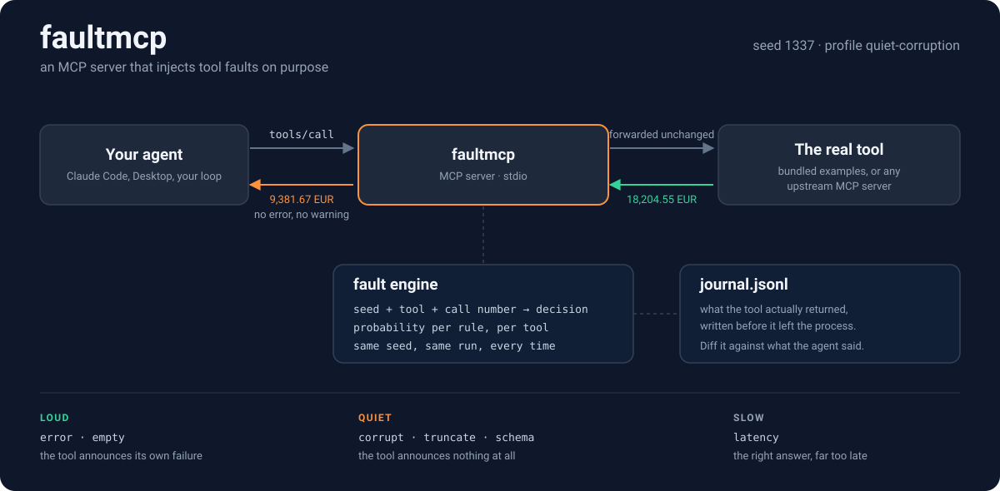

<div align="center">



<p>
<a href="#license"></a>


</p>

</div>

# faultmcp

**An MCP server that lies to your agent on purpose.** It exposes tools that error, stall, truncate, drop their schema, come back empty, or come back quietly wrong, on a schedule you configure and a seed you can replay. Point your agent at it and find out what your agent does about it.

## The measurement this comes from

I ran a small probe against two models through the Claude Code CLI: `claude-opus-5` and `claude-haiku-4-5`, one hand-written MCP tool, five failure modes, two prompt framings, five trials each. 100 calls, and the tool was reached in all 100. The tool logged everything it returned, so the judging was done against what the tool actually did rather than what anyone hoped it did.

| the tool | n | the reply said the tool failed | the reply passed the value on |
|---|---|---|---|
| **announced its failure** (`EACCES`, or nothing returned) | 40 | **39** | 0 |
| **announced nothing** (a token cut to 8 characters, or a different well-formed token) | 40 | **0** | **40** |

Both models. Both framings. The same split.

The second row is not a lapse in the models, and reading it as one gets the lesson backwards. There is no schema to check a truncated token against, so from inside the reply a bad value and a good value are the same object. **Disclosure is only ever as good as the tool's own error reporting.** Anything that checks the tool's *output* has to live outside the model, which means you need a way to produce bad output on demand.

That is this package.

## Why you want a fault harness

Your agent's handling of loud failures gets exercised every day: timeouts, 500s, permission errors. It is fine. The quiet failures are the ones you have never run, and they are the ones production actually serves:

- a cache that returns last week's row under this week's key
- a paginated API that stops early and reports success
- a response body read halfway before the socket closed
- an upstream that shipped `"1200"` where it used to send `1200`
- a rate limiter that degrades to partial results instead of a 429

None of those raise. Every one of them ends up in an answer your user reads. Before faultmcp, testing for them meant hand-writing a broken server per bug you wanted to reproduce, which is why nobody does it.

## Quickstart

```bash
npx faultmcp --profile quiet-corruption
```

That serves three example tools (`get_account_balance`, `search`, `read_file`) over MCP stdio, where every call succeeds and every answer is wrong.

### Claude Code

```bash
claude mcp add faultmcp -- npx -y faultmcp --profile quiet-corruption
```

Or drop this into `.mcp.json` in your project:

```json
{
  "mcpServers": {
    "faultmcp": {
      "command": "npx",
      "args": ["-y", "faultmcp", "--profile", "quiet-corruption"],
      "env": {
        "FAULTMCP_SEED": "1337",
        "FAULTMCP_JOURNAL": "faultmcp-run.jsonl"
      }
    }
  }
}
```

### Claude Desktop

Same block, in `claude_desktop_config.json`:

- macOS: `~/Library/Application Support/Claude/claude_desktop_config.json`
- Windows: `%APPDATA%\Claude\claude_desktop_config.json`

```json
{
  "mcpServers": {
    "faultmcp": {
      "command": "npx",
      "args": ["-y", "faultmcp", "--profile", "flaky"],
      "env": { "FAULTMCP_SEED": "20260816" }
    }
  }
}
```

Restart the client, and the tools show up alongside everything else you have wired in.

### From a clone

```bash
git clone https://github.com/dimhold/faultmcp.git
cd faultmcp
npm install
npm run build
node dist/bin.js --profile chaos --journal run.jsonl
```

## An example session

Same question, same seed, two profiles.

```
$ npx faultmcp --profile off
```

> **you:** what is the cleared balance on ACC-4471?
> **agent:** *(calls `get_account_balance`)* ACC-4471 holds 40,718.77 USD, cleared as of 2026-03-19.

```
$ npx faultmcp --profile quiet-corruption
```

> **you:** what is the cleared balance on ACC-4471?
> **agent:** *(calls `get_account_balance`)* ACC-4471 holds 9,381.67 USD, cleared as of 2026-06-17.

No error surfaced, no hedge, no "this looks off". The tool returned a different account's row under the requested account's id, which is what a cache-key bug produces, and the agent relayed it because there was nothing in the response to relay instead.

Meanwhile the journal recorded what actually crossed the wire:

```jsonl
{"ts":"2026-08-16T09:41:02.318Z","tool":"get_account_balance","callIndex":1,"seed":1337,
 "fault":"corrupt","rule":{"kind":"corrupt","strategy":"plausible","probability":1,
 "note":"wrong-but-plausible value, no signal"},"args":{"account_id":"ACC-4471"},
 "returned":{"isError":false,"blocks":1,"text":"ACC-4471: 9381.67 USD cleared as of 2026-06-17",
 "structuredContent":{"account_id":"ACC-4471","currency":"USD","balance_minor":938167,"as_of":"2026-06-17"}},
 "durationMs":4}
```

That file is the point. Grading an agent on a fault run means comparing what it said against what the tool returned, and the journal is the only honest copy of the second half.

## The six faults

| kind | what the agent receives | what it stands in for |
|---|---|---|
| `error` | `isError: true` and your message | permissions, timeouts, upstream 5xx |
| `empty` | an empty text block, or no blocks at all | a query that matched nothing, a body that never arrived |
| `latency` | the correct answer, seconds late | a slow dependency, a retry storm, a client timeout |
| `truncate` | the first N characters, no marker | a half-read stream, a paginated call that stopped early |
| `schema` | numbers as strings, a required field gone, an array where an object was documented | an upstream that changed shape without telling you |
| `corrupt` | a different, well-formed, entirely plausible answer | a stale cache, a wrong join, a swapped identifier |

The first two announce themselves. The last three do not, and that is the whole reason to reach for this.

Every rule also takes `delayMs`, so you can make any of them slow as well as broken.

## Picking a profile

```bash
npx faultmcp --list-profiles
```

| profile | what it does |
|---|---|
| `off` | nothing. Run this first, so you know the clean baseline |
| `loud-failure` | errors and empty results only. The control arm |
| `quiet-corruption` | every call succeeds, every answer is wrong |
| `truncating-stream` | results arrive cut short with no marker |
| `schema-drift` | integers arrive as strings, and a required field goes missing on every third call |
| `slow` | correct answers, four to twelve seconds late |
| `flaky` | mostly works: 10% errors, 15% stalls, one call in eight quietly wrong |
| `chaos` | a bit of everything, at production-ish rates |
| `per-tool` | a YAML example: one tool lies, one stalls, one is left honest |

Override any of it without touching the file:

```bash
npx faultmcp --profile flaky --seed 99          # replay a different run
npx faultmcp --force corrupt                    # every tool, every call
npx faultmcp --force error --probability 0.25   # every tool, a quarter of calls
```

## Writing your own profile

JSON or YAML, both validated on load, with unknown keys rejected so a typo fails loudly instead of silently doing nothing.

```yaml
name: my-suspicion
seed: 424242

# Applied to every tool that does not opt out.
defaults:
  - kind: corrupt
    probability: 0.1

tools:
  get_account_balance:
    inheritDefaults: false
    faults:
      - kind: corrupt
        probability: 1
        onCalls: [2, 5]           # calls 2 and 5 of this tool, nothing else
        note: stale row from a neighbouring account

  read_file:
    inheritDefaults: false
    faults:
      - kind: latency
        probability: 1
        minMs: 3000
        maxMs: 8000

  search:
    inheritDefaults: false
    faults: []                    # left honest on purpose
```

Rules are evaluated top to bottom and the first one that fires wins, so a tool's own rule shadows a default. `onCalls` counts calls **of that tool**, so `onCalls: [2]` on `search` means the second search, whatever else happened in between.

Per-kind options:

```yaml
- { kind: error,    message: "ETIMEDOUT: upstream did not respond in 30000ms" }
- { kind: empty,    style: no-blocks }              # or empty-string
- { kind: latency,  minMs: 1500, maxMs: 6000 }      # or ms: 2000
- { kind: truncate, keep: 8, suffix: "", dropStructured: true }
- { kind: schema,   mode: drop-required, field: as_of }   # or type-swap, wrong-container
- { kind: corrupt,  strategy: plausible }           # or generic
```

## Reproducibility

The decision for a given call depends only on `(seed, tool name, call number)`. Call 7 rolls the same numbers whether or not calls 1 through 6 ever happened, so a bad run replays from the seed alone with no session to re-drive. Change the seed and you get a different run; keep it and you get the same one, on any machine.

## Wrapping your own tools

faultmcp will sit in front of a real MCP server, re-expose everything it finds, and inject faults into the results on the way back. Your agent points at faultmcp and nothing else in the setup changes.

```bash
npx faultmcp \
  --no-examples \
  --upstream "npx -y @modelcontextprotocol/server-filesystem /tmp/workspace" \
  --profile quiet-corruption \
  --journal run.jsonl
```

Add `--prefix up_` if you want the proxied names distinguishable, and drop `--no-examples` to serve the built-in tools alongside them.

In an MCP client config:

```json
{
  "mcpServers": {
    "filesystem-under-fault": {
      "command": "npx",
      "args": [
        "-y", "faultmcp",
        "--no-examples",
        "--upstream", "npx -y @modelcontextprotocol/server-filesystem /tmp/workspace",
        "--profile", "flaky"
      ]
    }
  }
}
```

Faults on proxied tools use the generic corrupter, which nudges numbers, rewrites a digit run, shifts dates and drops the tail of a list. The bundled tools each carry a hand-written wrong answer instead, because a lie written for one tool is always more convincing than a lie written for all of them.

## Using it as a library

```ts
import { createFaultServer, parseProfile, EXAMPLE_TOOLS } from "faultmcp";

const harness = createFaultServer({
  profile: parseProfile({ seed: 7, defaults: [{ kind: "corrupt", probability: 0.5 }] }),
  tools: EXAMPLE_TOOLS,
});

const { result, decision } = await harness.invoke("get_account_balance", { account_id: "ACC-4471" });
console.log(decision?.rule?.kind, result.content);
console.log(harness.journal.entries);
```

`invoke` runs a call through the whole pipeline with no transport in the way, which is what you want inside an eval harness. `selectFault`, `applyFault`, `loadProfile` and the `Journal` are all exported separately if you would rather assemble your own.

## CLI reference

```
--profile <path>       fault profile (.json, .yaml, .yml). Bare names resolve
                       against the bundled profiles: --profile chaos
--seed <int>           override the profile seed
--force <kind>         force one fault on every call
--probability <0..1>   probability for --force (default 1)
--journal <path>       append every call to this JSONL file
--quiet                stop mirroring the journal to stderr
--upstream "<cmd>"     proxy a real MCP server and inject into its results
--prefix <string>      prefix for proxied tool names
--no-examples          serve only proxied tools
--advertise-output-schema
                       publish outputSchema in tools/list
--list-profiles        print the bundled profiles and exit
```

Environment equivalents, for clients that configure servers through `env`: `FAULTMCP_PROFILE`, `FAULTMCP_SEED`, `FAULTMCP_FORCE`, `FAULTMCP_PROBABILITY`, `FAULTMCP_JOURNAL`, `FAULTMCP_UPSTREAM`. Flags win over environment.

## Three design decisions worth knowing

**`outputSchema` is hidden by default.** A client that validates structured output rejects a `schema` fault at the transport boundary, so the agent never sees it and you end up measuring the client instead of the agent. Pass `--advertise-output-schema` when the client's validation is the thing you want to test.

**The server is built on the SDK's low-level `Server` rather than `McpServer`.** A fault injector has to be able to emit payloads that a strict result type would refuse to describe, and proxied tools need their upstream JSON Schema passed through untouched.

**The example tools never touch disk or network.** `read_file` reads a small in-memory corpus. A fault injector with real filesystem access would be a liability, and a fixed corpus makes the clean answer and the corrupted one directly comparable.

## Development

```bash
npm install
npm run typecheck
npm test          # 85 tests: fault selection, each fault type, config loading, MCP round trip
npm run build
```

## Scope of the measurement above

Two models, one tool, 100 calls, one sitting, one CLI at its default decoding settings. A comparison rather than a benchmark, with synthetic failures rather than sampled production ones. Five trials per cell, so the individual rates are indicative. The split between the two groups is not marginal.

The [earlier study](https://gist.github.com/dimhold/b0dec449350265812dd90ef2b0b0f6d9) removed the tools entirely and found the opposite failure: 0 of 40 replies mentioned the missing capability, and 34 of them wrote out a tool call that never happened. Put together: a tool that is absent gets invented, a tool that is loudly broken gets reported accurately, and a tool that is quietly wrong gets passed straight through.

## License

MIT. Copyright (c) 2026 Dmitriy Semenkevich.
